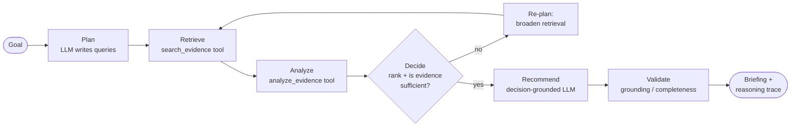
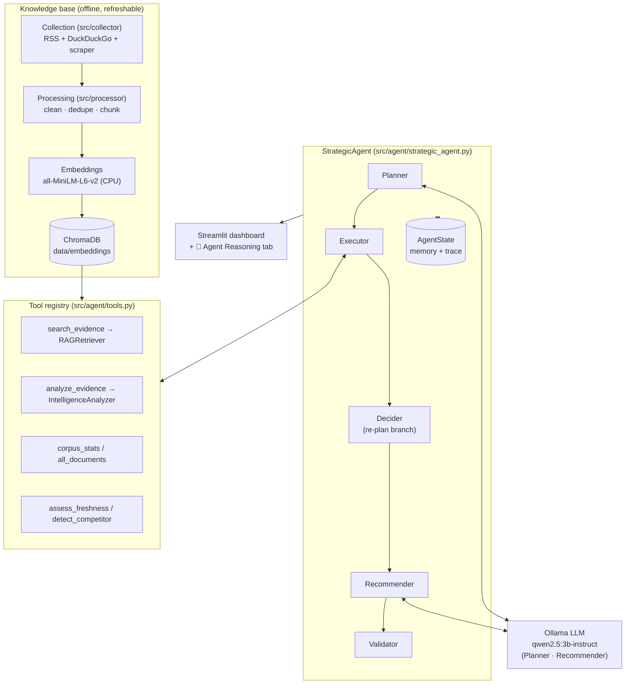

# AI CEO: Strategic Intelligence Agent (SAP)

An AI **agent** that collects public information about a company (default: **SAP**),
indexes it for retrieval, and then **plans, gathers evidence, analyzes, decides,
recommends, and validates its own recommendations** to produce an executive,
evidence-backed CEO briefing.

It answers the question: *"If you were the CEO today, what would you do next, and why?"*

Unlike a one-shot `prompt → LLM → answer` pipeline, the system runs an explicit
**agent loop**:

> **Goal → Plan → Retrieve → Analyze → Decide → Recommend → Validate**

with planning before execution, tool use beyond the LLM, autonomous decision-making,
and a self-validation step — all **fully local** (collection, embeddings, vector
search, and the reasoning LLM run on the user's machine; no paid/commercial LLM APIs).

---

## Table of contents
- [Key features](#key-features)
- [Agent capabilities](#agent-capabilities)
- [The agent loop](#the-agent-loop)
- [System architecture](#system-architecture)
- [Data flow](#data-flow)
- [Technology stack](#technology-stack)
- [Project structure](#project-structure)
- [Setup & run](#setup--run)
- [Design decisions](#design-decisions)

---

## Key features

- **Explicit agent loop** — a `StrategicAgent` orchestrator that plans, uses tools to
  retrieve and analyze evidence, decides what matters, recommends actions, and
  validates them before presenting. Every step is recorded in an observable
  **reasoning trace**.
- **Live multi-source collection** — company RSS (SAP Newsroom), financial/industry
  news, and competitor/market sources (Oracle, Salesforce, Microsoft, Workday,
  ServiceNow). 100+ documents, 3+ independent source types.
- **Knowledge repository** — documents are cleaned, de-duplicated, chunked, embedded,
  and indexed in **ChromaDB** for semantic retrieval.
- **Strategic Intelligence Engine** — keyword + freshness scoring surfaces
  **opportunities, risks, trends, competitor signals**, sentiment, risk categories,
  and a sentiment-over-time trend, with confidence scores.
- **Self-validation (anti-hallucination)** — each recommendation is checked for
  grounding (does its cited evidence actually exist in the corpus?), completeness, and
  consistency *before* it is shown; unsupported recommendations are dropped.
- **Local open-source LLM** — Ollama / `qwen2.5:3b-instruct` drives planning,
  recommendation, and reasoning. A deterministic fallback guarantees a complete answer
  even if the LLM is unavailable.
- **Executive dashboard** — a Streamlit app (shadcn-inspired UI) with a Company
  Overview, an **🧠 Agent Reasoning** tab (plan, trace, decisions, validation), Market
  Intelligence, Opportunities & Risks, and Sentiment analysis.

---

## Agent capabilities

The agent is built to demonstrate explicit agent behaviour, not just LLM usage:

| Capability | Where it lives | What it does |
|---|---|---|
| **Planning before execution** | `planner.py` | The LLM turns the goal into an investigation plan (a search query per intelligence view) before any retrieval. |
| **Tool usage beyond the LLM** | `tools.py`, `executor.py` | Retrieval, analysis, corpus stats, freshness, and competitor detection are exposed as named **tools** the agent invokes (not work hidden inside a prompt). |
| **Retrieval & use of evidence** | `retriever.py` + ChromaDB | Each planned query pulls real document chunks; recommendations cite them. |
| **Analysis of risks / opportunities / trends** | `analyzer.py` | Deterministic keyword + freshness scoring into ranked, categorized signals + sentiment. |
| **Autonomous decision-making** | `decider.py` | Ranks signals by *impact × confidence × freshness*, selects the critical few, and **gates on evidence sufficiency** — looping back to retrieve more if the evidence is thin. |
| **Validation before presenting** | `validator.py` | Self-critique: grounding, completeness, and consistency checks; drops unsupported recommendations. |
| **Orchestration + memory + trace** | `strategic_agent.py`, `agent_state.py` | Runs the whole loop, carries shared state across phases, and logs every action for the dashboard. |

---

## The agent loop



**Phases**
1. **Plan** — `Planner` (LLM, with deterministic fallback) emits an ordered plan: one
   semantic-search query per view (opportunities, risks, competitors, trends).
2. **Retrieve** — `Executor` runs each query through the `search_evidence` tool against
   ChromaDB, plus `all_documents` / `corpus_stats`.
3. **Analyze** — the `analyze_evidence` tool scores evidence into signals + sentiment.
4. **Decide** — `Decider` ranks signals and runs a **sufficiency gate**; if evidence is
   insufficient it autonomously broadens retrieval and re-decides (bounded by
   `max_replans`).
5. **Recommend** — `Recommender` seeds the LLM with the ranked decisions and overlays
   its output onto a deterministic fallback briefing.
6. **Validate** — `Validator` self-checks each recommendation (grounding /
   completeness / consistency) and drops unsupported ones before presenting.

Every phase writes a `TraceEntry` into `AgentState`, rendered in the dashboard's
**🧠 Agent Reasoning** tab.

---

## System architecture



---

## Data flow

```mermaid
flowchart LR
    A["Public sources<br/>(RSS, news, market)"] -->|collect| B["data/raw/*.json"]
    B -->|clean + dedupe| C["data/processed/cleaned"]
    C -->|chunk| D["data/processed/chunks"]
    D -->|embed + index| E[("ChromaDB")]
    E -->|agent: search_evidence| F["Analyzer (signals + sentiment)"]
    F -->|ranked decisions| G["Recommender (LLM)"]
    G -->|recommendations| H["Validator (grounding check)"]
    H -->|validated briefing + trace| I["Streamlit dashboard"]
```



**Offline collection** (build the knowledge base) is run on demand to refresh the
corpus. **Serving** (the agent loop) happens live each time the user clicks
*Run Strategic Agent*.

---

## Technology stack

| Layer | Choice |
|---|---|
| Language | Python 3.11 |
| Collection | `feedparser` (RSS), `ddgs` (DuckDuckGo search), `requests` + `beautifulsoup4` / `lxml` (scraping) |
| Data model | `pydantic` (`DocumentRecord`) |
| Embeddings | `sentence-transformers` — `all-MiniLM-L6-v2` (runs on CPU) |
| Vector store | **ChromaDB** (persistent, local) |
| Retrieval | Multi-view semantic search / RAG |
| Reasoning LLM | **Ollama** running `qwen2.5:3b-instruct` (open-source, local) |
| Agent | Hand-built orchestrator: Planner / Executor / Decider / Recommender / Validator + tool registry + `AgentState` |
| Dashboard | **Streamlit** + custom CSS (shadcn-inspired), `pandas` for tables/charts |

> **Constraint compliance:** the reasoning engine is a freely available, open-source
> model served locally via Ollama. No OpenAI / Anthropic / Gemini / paid APIs are used.

---

## Project structure

```
sap-intelligence-agent/
├── src/
│   ├── config.py                 # Central config (sources, models, retrieval, LLM)
│   ├── schemas.py                # DocumentRecord (pydantic)
│   ├── collector/                # Live data collection
│   │   ├── company_collector.py  #   SAP Newsroom RSS
│   │   ├── news_collector.py     #   Financial/industry news (DuckDuckGo)
│   │   ├── market_collector.py   #   Competitor/market sources (DuckDuckGo)
│   │   ├── master_collector.py   #   Orchestrates + dedupes + saves raw
│   │   └── utils.py              #   Scraping + retry helpers
│   ├── processor/
│   │   ├── cleaner.py            # Normalize + dedupe by content hash
│   │   └── chunker.py            # Chunk text (1200/200)
│   ├── storage/
│   │   ├── vector_store.py       # Build/index embeddings into ChromaDB
│   │   └── repository.py         # Chroma client, search, corpus stats, all_documents
│   ├── agent/                    # ── The AI agent ──
│   │   ├── strategic_agent.py    #   Orchestrator: runs Goal→…→Validate (+ re-plan)
│   │   ├── agent_state.py        #   Working memory + reasoning trace
│   │   ├── tools.py              #   Tool registry (search/analyze/stats/freshness)
│   │   ├── planner.py            #   Plan: LLM writes per-view queries
│   │   ├── executor.py           #   Retrieve + Analyze via tools
│   │   ├── decider.py            #   Rank signals + evidence-sufficiency gate
│   │   ├── recommender.py        #   Decision-grounded recommendations (LLM + fallback)
│   │   ├── validator.py          #   Self-check: grounding / completeness / consistency
│   │   ├── retriever.py          #   Multi-view RAG retrieval
│   │   ├── analyzer.py           #   Intelligence engine (signals / sentiment)
│   │   ├── llm_adapter.py        #   Ollama wrapper (JSON mode, run_json/generate)
│   │   └── strategist.py         #   Briefing prompt + deterministic fallback builders
│   └── dashboard/
│       ├── app.py                # Streamlit dashboard + 🧠 Agent Reasoning tab
│       └── metrics.py            # Per-run dashboard metrics
├── data/
│   ├── raw/                      # Collected documents
│   ├── processed/                # Cleaned + chunked documents
│   └── embeddings/               # ChromaDB persistent store
├── .streamlit/config.toml        # Light theme
├── requirements.txt
└── README.md
```

---

## Setup & run

### Prerequisites
- Python 3.11
- [Ollama](https://ollama.com) installed and running, with the model pulled:
  ```bash
  ollama pull qwen2.5:3b-instruct
  ```

### Install
```bash
python -m venv sapenv2
sapenv2\Scripts\activate          # Windows
pip install -r requirements.txt
```

### 1) Build the knowledge base (offline, run to refresh data)
```bash
python -m src.collector.master_collector   # collect -> data/raw
python -m src.processor.cleaner             # clean   -> data/processed
python -m src.processor.chunker             # chunk   -> data/processed
python -m src.storage.vector_store          # embed + index -> data/embeddings
```

### 2) Launch the dashboard
```bash
streamlit run src/dashboard/app.py
```
> Run from the **project root** (not from `src/`) so the `data/embeddings` path
> resolves correctly.

Enter a **Goal**, click **Run Strategic Agent**, wait ~1–2 min, then open the
**🧠 Agent Reasoning** tab to watch the full loop (plan, trace, decisions, validation).

---

## Design decisions

- **Hand-built orchestrator (not LangChain/LangGraph).** A lightweight, transparent
  loop is fully explainable, has no extra dependencies, works offline, and is more
  reliable than free-form ReAct on a small 3B model. The LLM is used for bounded
  reasoning steps (planning, recommending) while deterministic tools do the work.
- **Hybrid intelligence: deterministic engine + LLM.** The keyword/freshness analyzer
  and the decider are fast, reproducible, and explainable ("ranked #1 because High
  impact, 0.93 confidence, recent"); the LLM adds fluent narrative. Separating
  *analytics* from *generation* gives trust **and** readability.
- **Self-validation / reflection.** The `Validator` checks each recommendation's
  evidence against the retrieved corpus before presenting — the agent's defence against
  hallucination, and the difference between "an LLM that generates" and "an agent that
  checks its own work".
- **Autonomous re-plan branch.** The Decider's sufficiency gate lets the agent decide
  to gather more evidence rather than recommend on thin data — bounded by `max_replans`
  so it always terminates.
- **Local, open-source LLM via Ollama.** Required by the brief (no paid APIs) and keeps
  data on-device. `qwen2.5:3b-instruct` fits entirely within a 4 GB GPU (GTX 1650),
  avoiding the host-memory offload failures the 7B model hit.
- **Embedding model pinned to CPU.** `all-MiniLM-L6-v2` is small; running it on CPU
  leaves the limited GPU VRAM free for the LLM, preventing allocation conflicts.
- **ChromaDB as the repository.** A lightweight, file-persistent vector DB — no server
  to manage, ideal for a local single-user analytical tool. Uses HNSW approximate
  nearest-neighbour search.
- **Multi-view RAG instead of a single query.** Separate opportunity/risk/competitor/
  trend queries retrieve more diverse, role-specific evidence than one generic query.
- **Constrained JSON generation.** `format="json"` plus slim prompts and an 8k context
  window make the small model reliably emit parseable JSON; outputs are normalized so
  list fields are always readable strings, and the deterministic fallback overlay keeps
  every field complete.
- **Chunking (1200/200).** Balances retrieval granularity against context size; overlap
  preserves meaning across chunk boundaries.
- **Telemetry & offline hardening.** ChromaDB telemetry is disabled and HuggingFace is
  set to offline mode so the app starts quickly and works without network access once
  models are cached.
