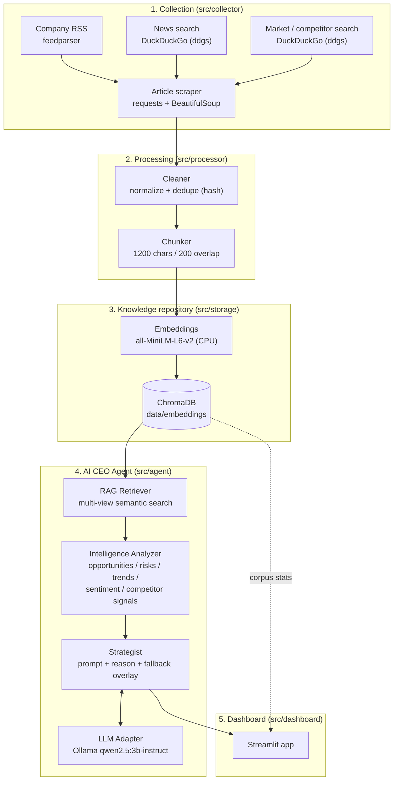

# AI CEO: Strategic Intelligence Agent (SAP)

An AI-powered Strategic Intelligence Agent that continuously collects public
information about a company (default: **SAP**), indexes it for retrieval, and
reasons over it with a **local open-source LLM** to produce **executive-level,
evidence-backed recommendations**.

It answers the question: *"If you were the CEO today, what would you do next, and why?"*

The system is fully local — collection, embeddings, vector search, and the
reasoning LLM all run on the user's machine. No paid/commercial LLM APIs are used.

---

## Table of contents
- [Key features](#key-features)
- [System architecture](#system-architecture)
- [Data flow](#data-flow)
- [AI pipeline](#ai-pipeline)
- [Technology stack](#technology-stack)
- [Project structure](#project-structure)
- [Setup & run](#setup--run)
- [Design decisions](#design-decisions)

---

## Key features

- **Live multi-source collection** — company RSS (SAP Newsroom), financial/industry
  news, and competitor/market sources (Oracle, Salesforce, Microsoft, Workday,
  ServiceNow). 100+ documents, 3+ independent source types.
- **Knowledge repository** — documents are cleaned, de-duplicated, chunked, embedded,
  and indexed in **ChromaDB** for semantic retrieval.
- **Strategic Intelligence Engine** — keyword + freshness scoring surfaces
  **opportunities, risks, trends, competitor signals**, sentiment, and risk categories
  with confidence scores.
- **AI CEO Agent** — a local LLM (Ollama / `qwen2.5:3b-instruct`) reasons over the
  retrieved evidence and produces a CEO briefing + prioritized, evidence-backed
  recommendations. A deterministic fallback guarantees a complete answer even if the
  LLM is unavailable.
- **Executive dashboard** — a Streamlit app (shadcn-inspired UI) with Company Overview,
  Market Intelligence, Opportunities & Risks, Sentiment analysis (with trends), and a
  CEO Briefing.

---

## System architecture



---

## Data flow

```mermaid
flowchart LR
    A["Public sources<br/>(RSS, news, market)"] -->|collect| B["data/raw/<br/>sap_raw_documents.json"]
    B -->|clean + dedupe| C["data/processed/<br/>sap_cleaned_documents.json"]
    C -->|chunk| D["data/processed/<br/>sap_chunks.json"]
    D -->|embed + index| E[("ChromaDB<br/>data/embeddings")]
    E -->|multi-view retrieval| F["Analyzer<br/>(opportunities, risks,<br/>trends, sentiment)"]
    F -->|structured prompt| G["Local LLM<br/>(Ollama)"]
    G -->|JSON briefing| H["Strategist<br/>(merge over fallback)"]
    F --> H
    H -->|response + corpus stats| I["Streamlit dashboard"]
```



**Offline collection** (steps 1–4) is run on demand to refresh the corpus.
**Serving** (steps 5+) happens live each time the user clicks *Generate CEO Briefing*.

---

## AI pipeline

1. **Retrieval (RAG).** `RAGRetriever.retrieve_multi_view()` issues **four query
   "views"** — opportunities, risks, competitors, trends — against ChromaDB, each
   returning the top-K (default 40) most semantically similar chunks. Queries and
   chunks are embedded with the same `all-MiniLM-L6-v2` model.
2. **Analysis.** `IntelligenceAnalyzer` deduplicates the retrieved evidence and scores
   each item with keyword lexicons (opportunity / risk / trend) blended with a
   **freshness** score and a **source-type** weight to produce a confidence score,
   impact/severity level, **risk category**, and sentiment. It also builds
   competitor signals and a **sentiment-over-time trend**.
3. **Prompting.** `AICEOStrategist.build_prompt()` serializes a *slim* view of the
   analysis (titles + key signals only) into a structured JSON-schema prompt, keeping
   the context small so the model has room to write its response.
4. **Generation.** `OllamaLLM.generate()` calls the local model with
   `format="json"` (constrained JSON decoding) and a larger context window
   (`num_ctx=8192`), then extracts and normalizes the JSON.
5. **Robust assembly.** The strategist always builds a **deterministic fallback**
   briefing from the analysis, then **overlays** the LLM's non-empty fields on top.
   This guarantees a complete, evidence-backed briefing whether the LLM fully
   succeeds, partially succeeds, or is unavailable.

Every recommendation includes a **title, priority, expected impact, risk level,
confidence score, and supporting evidence**.

---

## Technology stack

| Layer | Choice |
|---|---|
| Language | Python 3.11 |
| Collection | `feedparser` (RSS), `ddgs` (DuckDuckGo search), `requests` + `beautifulsoup4` / `lxml` (scraping) |
| Data model | `pydantic` (`DocumentRecord`) |
| Embeddings | `sentence-transformers` — `all-MiniLM-L6-v2` (runs on CPU) |
| Vector store | **ChromaDB** (persistent, local) |
| Reasoning LLM | **Ollama** running `qwen2.5:3b-instruct` (open-source, local) |
| Retrieval | Multi-view semantic search / RAG |
| Dashboard | **Streamlit** (1.46) + custom CSS (shadcn-inspired), `pandas` for charts |

> **Constraint compliance:** the reasoning engine is a freely available, open-source
> model served locally via Ollama. No OpenAI / Anthropic / Gemini / paid APIs are used.

---

## Project structure

```
sap-intelligence-agent/
├── src/
│   ├── config.py                 # Central config (sources, models, retrieval, LLM)
│   ├── schemas.py                # DocumentRecord (pydantic)
│   ├── collector/
│   │   ├── company_collector.py  # SAP Newsroom RSS
│   │   ├── news_collector.py     # Financial/industry news (DuckDuckGo)
│   │   ├── market_collector.py   # Competitor/market sources (DuckDuckGo)
│   │   ├── master_collector.py   # Orchestrates + dedupes + saves raw
│   │   └── utils.py              # Scraping + retry helpers
│   ├── processor/
│   │   ├── cleaner.py            # Normalize + dedupe by content hash
│   │   └── chunker.py            # Chunk text (1200/200)
│   ├── storage/
│   │   ├── vector_store.py       # Build/index embeddings into ChromaDB
│   │   └── repository.py         # Chroma client, search, corpus stats
│   ├── agent/
│   │   ├── retriever.py          # Multi-view RAG retrieval
│   │   ├── analyzer.py           # Intelligence engine (signals/sentiment)
│   │   ├── llm_adapter.py        # Ollama wrapper (JSON mode)
│   │   └── strategist.py         # AI CEO orchestration + fallback overlay
│   └── dashboard/
│       ├── app.py                # Streamlit executive dashboard
│       └── metrics.py            # Per-run dashboard metrics
├── data/
│   ├── raw/                      # Collected documents
│   ├── processed/                # Cleaned + chunked documents
│   └── embeddings/               # ChromaDB persistent store
├── .streamlit/config.toml        # Light theme
├── requirements.txt
└── README.md
```

---

## Setup & run

### Prerequisites
- Python 3.11
- [Ollama](https://ollama.com) installed and running, with the model pulled:
  ```bash
  ollama pull qwen2.5:3b-instruct
  ```

### Install
```bash
python -m venv sapenv2
sapenv2\Scripts\activate          # Windows
pip install -r requirements.txt
```

### 1) Build the knowledge base (offline, run to refresh data)
```bash
python -m src.collector.master_collector   # collect -> data/raw
python -m src.processor.cleaner             # clean   -> data/processed
python -m src.processor.chunker             # chunk   -> data/processed
python -m src.storage.vector_store          # embed + index -> data/embeddings
```

### 2) Launch the dashboard
```bash
streamlit run src/dashboard/app.py
```
Open the URL Streamlit prints, then click **Generate CEO Briefing**.

---

## Design decisions

- **Local, open-source LLM via Ollama.** Required by the brief (no paid APIs) and keeps
  data on-device. `qwen2.5:3b-instruct` was chosen because it fits entirely within a
  4 GB GPU (GTX 1650), avoiding the host-memory offload failures the 7B model hit.
- **Embedding model pinned to CPU.** `all-MiniLM-L6-v2` is small; running it on CPU
  leaves the limited GPU VRAM free for the LLM, preventing allocation conflicts.
- **ChromaDB as the repository.** A lightweight, file-persistent vector DB — no server
  to manage, ideal for a local single-user analytical tool.
- **Multi-view RAG instead of a single query.** Separate opportunity/risk/competitor/
  trend queries retrieve more diverse, role-specific evidence than one generic query.
- **Deterministic engine + LLM overlay.** The keyword/freshness analyzer is fast,
  transparent, and always produces structured signals; the LLM adds narrative reasoning
  on top. Overlaying LLM output onto the deterministic fallback guarantees a complete,
  non-empty briefing even when a small local model returns sparse output.
- **Constrained JSON generation.** `format="json"` plus a slim prompt and an 8k context
  window make the small model reliably emit parseable, complete JSON.
- **Chunking (1200/200).** Balances retrieval granularity against context size; overlap
  preserves meaning across chunk boundaries.
- **Telemetry & offline hardening.** ChromaDB telemetry is disabled and HuggingFace is
  set to offline mode so the app starts quickly and works without network access once
  models are cached.
